# Teams Bot SDK Architecture Documentation

## Overview

The Teams Bot SDK consists of three layered projects that provide a modern, efficient, and backward-compatible framework for building Microsoft Teams bots.

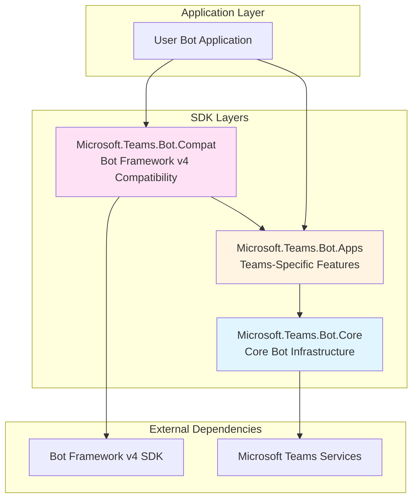

---

## 1. Microsoft.Teams.Bot.Core

**Purpose**: Provides the foundational infrastructure for building Teams bots with a clean, modern API focused on performance and System.Text.Json serialization.

### Architecture Overview

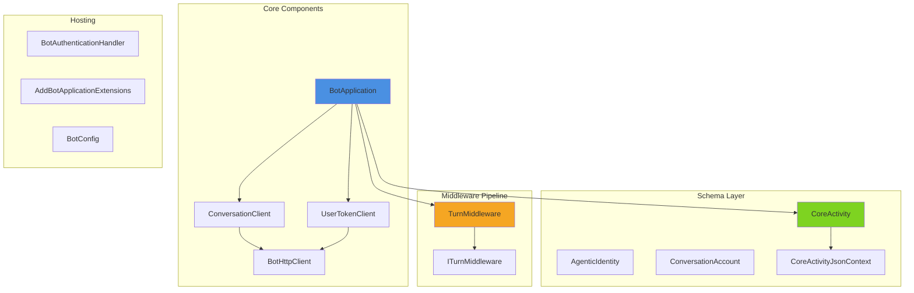

### Core Patterns

#### 1. **Middleware Pipeline Pattern**

The middleware pipeline allows processing activities through a chain of handlers.

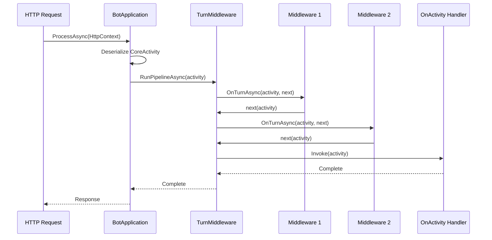

**Key Classes**:
- `TurnMiddleware`: Manages the middleware pipeline execution
- `ITurnMiddleware`: Interface for custom middleware components
- `BotApplication`: Orchestrates activity processing

#### 2. **Client Pattern**

Separate clients handle different aspects of bot communication.

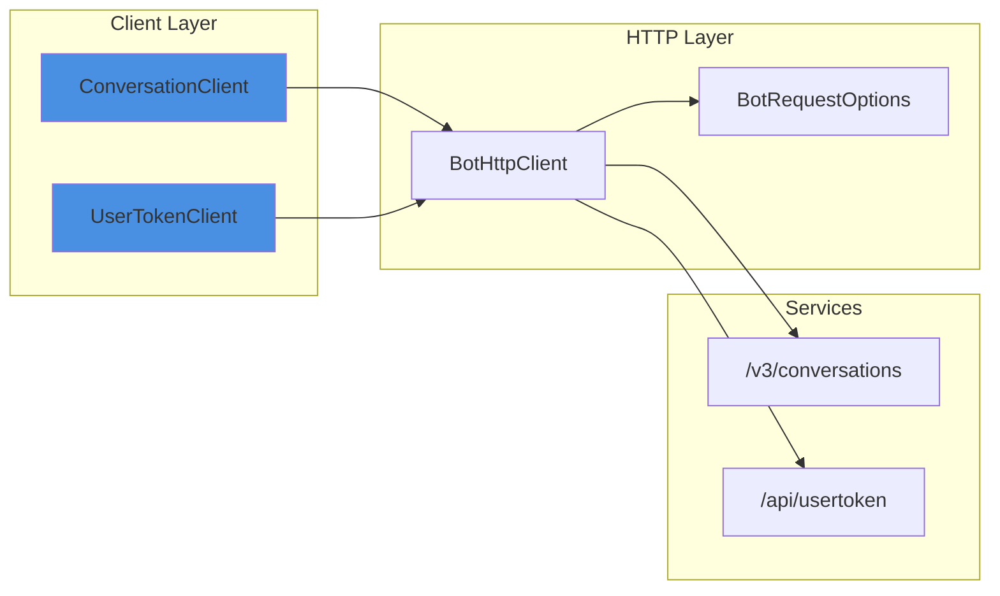

**Key Features**:
- `ConversationClient`: Manages conversation operations (send, reply, get members)
- `UserTokenClient`: Handles OAuth token operations
- `BotHttpClient`: Centralized HTTP client with authentication and retry logic
- `BotRequestOptions`: Configures requests with authentication and custom headers

#### 3. **Schema with Source Generation**

Uses System.Text.Json source generators for optimal performance.

```csharp
[JsonSerializable(typeof(CoreActivity))]
[JsonSerializable(typeof(ConversationAccount))]
internal partial class CoreActivityJsonContext : JsonSerializerContext
{
}
```

**Benefits**:
- Zero-allocation JSON serialization
- AOT (Ahead-of-Time) compilation support
- Faster startup time
- Smaller deployment size

### Key Components

| Component | Purpose | Pattern |
|-----------|---------|---------|
| `BotApplication` | Main entry point for processing activities | Facade |
| `ConversationClient` | Manages conversation operations | Client |
| `UserTokenClient` | Handles user authentication tokens | Client |
| `BotHttpClient` | Centralized HTTP communication | Client |
| `TurnMiddleware` | Executes middleware pipeline | Chain of Responsibility |
| `CoreActivity` | Activity model with source generation | DTO |
| `AgenticIdentity` | Authentication identity for API calls | DTO |
| `BotAuthenticationHandler` | JWT authentication for ASP.NET Core | Authentication Handler |

### Configuration

```csharp
services.AddBotApplication(configuration);
// Registers:
// - BotApplication (Singleton)
// - ConversationClient (Singleton)
// - UserTokenClient (Singleton)
// - BotHttpClient (Singleton)
// - Authentication handlers
```

---

## 2. Microsoft.Teams.Bot.Apps

**Purpose**: Extends Core with Teams-specific features, handlers, and the TeamsApiClient for advanced Teams operations.

### Architecture Overview

```mermaid
graph TB
    subgraph "Application Layer"
        TeamsBotApp[TeamsBotApplication]
        Builder[TeamsBotApplicationBuilder]
    end

    subgraph "Handler System"
        MsgHandler[MessageHandler]
        ConvHandler[ConversationUpdateHandler]
        InvokeHandler[InvokeHandler]
        InstallHandler[InstallationUpdateHandler]
        ReactionHandler[MessageReactionHandler]
    end

    subgraph "Teams API Client"
        TeamsAPI[TeamsApiClient]
        MeetingOps[Meeting Operations]
        TeamOps[Team Operations]
        BatchOps[Batch Operations]
    end

    subgraph "Schema Layer"
        TeamsActivity[TeamsActivity]
        TeamsChannelData[TeamsChannelData]
        TeamsAttachment[TeamsAttachment]
        Entities[Entity Types]
    end

    subgraph "Context"
        Context[Context]
    end

    TeamsBotApp --> TeamsAPI
    TeamsBotApp --> MsgHandler
    TeamsBotApp --> ConvHandler
    TeamsBotApp --> InvokeHandler
    TeamsBotApp --> InstallHandler
    TeamsBotApp --> ReactionHandler

    MsgHandler --> Context
    ConvHandler --> Context
    InvokeHandler --> Context

    TeamsAPI --> MeetingOps
    TeamsAPI --> TeamOps
    TeamsAPI --> BatchOps

    TeamsBotApp --> TeamsActivity
    TeamsActivity --> TeamsChannelData

    style TeamsBotApp fill:#5856d6
    style TeamsAPI fill:#ff9500
    style Context fill:#34c759
```

### Core Patterns

#### 1. **Handler Pattern with Typed Arguments**

Teams-specific activities are routed to typed handlers.

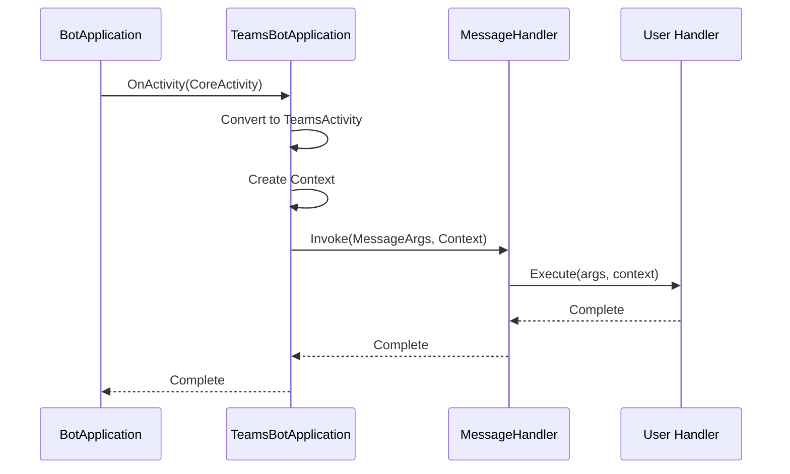

**Handler Types**:
```csharp
public delegate Task MessageHandler(MessageArgs args, Context context, CancellationToken ct);
public delegate Task ConversationUpdateHandler(ConversationUpdateArgs args, Context context, CancellationToken ct);
public delegate Task<CoreInvokeResponse> InvokeHandler(Context context, CancellationToken ct);
public delegate Task InstallationUpdateHandler(InstallationUpdateArgs args, Context context, CancellationToken ct);
public delegate Task MessageReactionHandler(MessageReactionArgs args, Context context, CancellationToken ct);
```

#### 2. **Builder Pattern for Application Configuration**

Fluent API for configuring Teams bot applications.

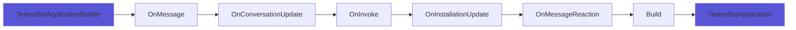

**Usage**:
```csharp
var builder = new TeamsBotApplicationBuilder()
    .OnMessage(async (args, context, ct) => {
        await context.SendActivityAsync("Hello!");
    })
    .OnConversationUpdate(async (args, context, ct) => {
        // Handle member added/removed
    })
    .OnInvoke(async (context, ct) => {
        return new CoreInvokeResponse { Status = 200 };
    });

var app = builder.Build(services);
```

#### 3. **Context Pattern**

Provides a rich context object for bot operations.

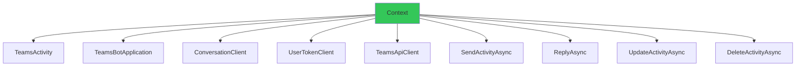

**Key Features**:
- Encapsulates current activity and bot application
- Provides convenience methods for common operations
- Access to all clients (Conversation, Token, Teams)
- Simplified response methods

#### 4. **Teams API Client Pattern**

Specialized client for Teams-specific operations.

```mermaid
graph TB
    subgraph "TeamsApiClient"
        Client[TeamsApiClient]
    end

    subgraph "Meeting Operations"
        FetchMeeting[FetchMeetingInfoAsync]
        FetchParticipant[FetchParticipantAsync]
        SendNotification[SendMeetingNotificationAsync]
    end

    subgraph "Team Operations"
        FetchTeam[FetchTeamDetailsAsync]
        FetchChannels[FetchChannelListAsync]
    end

    subgraph "Batch Operations"
        SendToUsers[SendMessageToListOfUsersAsync]
        SendToChannels[SendMessageToListOfChannelsAsync]
        SendToTeam[SendMessageToAllUsersInTeamAsync]
        SendToTenant[SendMessageToAllUsersInTenantAsync]
        GetOpState[GetOperationStateAsync]
        GetFailed[GetPagedFailedEntriesAsync]
        Cancel[CancelOperationAsync]
    end

    Client --> FetchMeeting
    Client --> FetchParticipant
    Client --> SendNotification
    Client --> FetchTeam
    Client --> FetchChannels
    Client --> SendToUsers
    Client --> SendToChannels
    Client --> SendToTeam
    Client --> SendToTenant
    Client --> GetOpState
    Client --> GetFailed
    Client --> Cancel

    style Client fill:#ff9500
```

### Key Components

| Component | Purpose | Pattern |
|-----------|---------|---------|
| `TeamsBotApplication` | Teams-specific bot application | Specialization |
| `TeamsBotApplicationBuilder` | Fluent configuration API | Builder |
| `TeamsApiClient` | Teams-specific API operations | Client |
| `Context` | Rich context for handlers | Context Object |
| `TeamsActivity` | Teams-enhanced activity model | DTO |
| `MessageHandler` | Delegate for message handling | Handler |
| `ConversationUpdateHandler` | Delegate for conversation updates | Handler |
| `InvokeHandler` | Delegate for invoke activities | Handler |
| `TeamsChannelData` | Teams-specific channel data | DTO |
| `Entity` | Base class for activity entities | DTO |

### REST API Endpoints

| Operation | Endpoint | Description |
|-----------|----------|-------------|
| Meeting Info | `GET /v1/meetings/{meetingId}` | Get meeting details |
| Participant | `GET /v1/meetings/{meetingId}/participants/{participantId}` | Get participant info |
| Notification | `POST /v1/meetings/{meetingId}/notification` | Send in-meeting notification |
| Team Details | `GET /v3/teams/{teamId}` | Get team information |
| Channels | `GET /v3/teams/{teamId}/channels` | List team channels |
| Batch Users | `POST /v3/batch/conversation/users/` | Message multiple users |
| Batch Channels | `POST /v3/batch/conversation/channels/` | Message multiple channels |
| Batch Team | `POST /v3/batch/conversation/team/` | Message all team members |
| Batch Tenant | `POST /v3/batch/conversation/tenant/` | Message entire tenant |
| Operation State | `GET /v3/batch/conversation/{operationId}` | Get batch operation status |
| Failed Entries | `GET /v3/batch/conversation/failedentries/{operationId}` | Get failed batch entries |
| Cancel Operation | `DELETE /v3/batch/conversation/{operationId}` | Cancel batch operation |

### Configuration

```csharp
services.AddTeamsBotApplication(configuration);
// Registers everything from Core plus:
// - TeamsBotApplication (Singleton)
// - TeamsApiClient (Singleton)
// - IHttpContextAccessor
```

---

## 3. Microsoft.Teams.Bot.Compat

**Purpose**: Provides backward compatibility with Bot Framework v4 SDK, allowing existing bots to migrate incrementally to the new Teams SDK.

### Architecture Overview

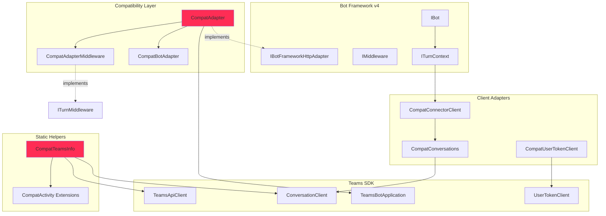

### Core Patterns

#### 1. **Adapter Pattern**

Bridges Bot Framework v4 interfaces to Teams SDK implementations.

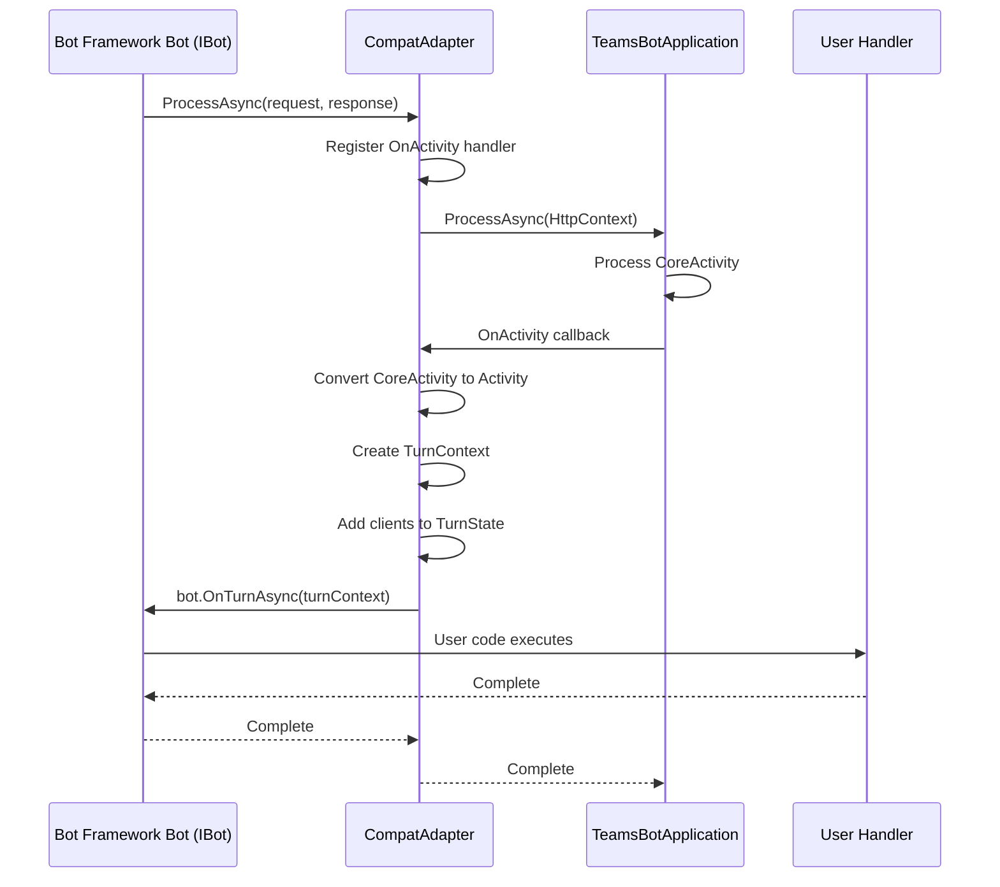

**Key Adaptations**:
- `IBotFrameworkHttpAdapter` → `TeamsBotApplication`
- `IBot.OnTurnAsync` → `BotApplication.OnActivity`
- `ITurnContext` → `CoreActivity`
- `IConnectorClient` → `ConversationClient`
- `UserTokenClient` → `UserTokenClient`

#### 2. **Wrapper Pattern for Clients**

Wraps Core SDK clients to implement Bot Framework v4 interfaces.

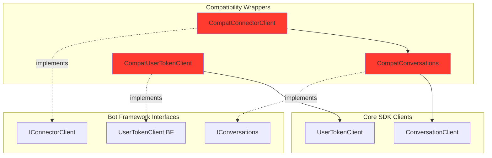

#### 3. **Static Helper Adaptation Pattern**

Replicates Bot Framework TeamsInfo static methods using Core SDK.

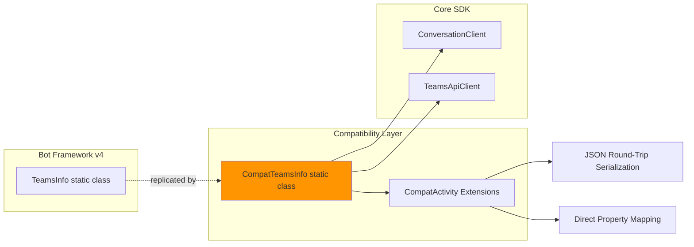

**Key Methods** (19 total):
- Member operations: GetMemberAsync, GetPagedMembersAsync, etc.
- Meeting operations: GetMeetingInfoAsync, SendMeetingNotificationAsync
- Team operations: GetTeamDetailsAsync, GetTeamChannelsAsync
- Batch operations: SendMessageToListOfUsersAsync, GetOperationStateAsync

#### 4. **Middleware Bridge Pattern**

Allows Bot Framework middleware to work with Core SDK middleware pipeline.

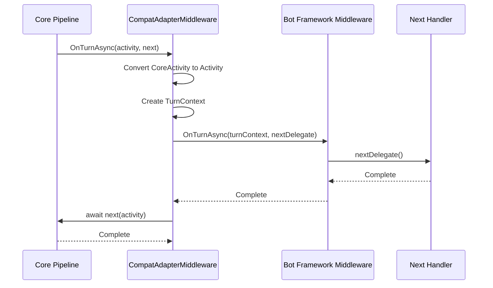

#### 5. **Model Conversion Pattern**

Two strategies for converting between Bot Framework and Core models:

**Strategy 1: Direct Property Mapping**
```csharp
public static TeamsChannelAccount ToCompatTeamsChannelAccount(
    this TeamsConversationAccount account)
{
    return new TeamsChannelAccount
    {
        Id = account.Id,
        Name = account.Name,
        AadObjectId = account.AadObjectId,
        Email = account.Email,
        GivenName = account.GivenName,
        Surname = account.Surname,
        UserPrincipalName = account.UserPrincipalName,
        UserRole = account.UserRole,
        TenantId = account.TenantId
    };
}
```

**Strategy 2: JSON Round-Trip** (for complex models)
```csharp
public static TeamDetails ToCompatTeamDetails(this Apps.TeamDetails teamDetails)
{
    var json = System.Text.Json.JsonSerializer.Serialize(teamDetails);
    return Newtonsoft.Json.JsonConvert.DeserializeObject<TeamDetails>(json)!;
}
```

### Key Components

| Component | Purpose | Pattern |
|-----------|---------|---------|
| `CompatAdapter` | Main adapter implementing Bot Framework interface | Adapter |
| `CompatBotAdapter` | Base adapter for turn context creation | Adapter |
| `CompatConnectorClient` | Wraps connector client functionality | Wrapper |
| `CompatConversations` | Wraps conversation operations | Wrapper |
| `CompatUserTokenClient` | Wraps token client functionality | Wrapper |
| `CompatAdapterMiddleware` | Bridges middleware systems | Bridge |
| `CompatTeamsInfo` | Static helper methods for Teams operations | Static Helper |
| `CompatActivity` | Extension methods for model conversion | Extension Methods |

### Migration Path

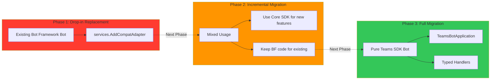

### Configuration

```csharp
services.AddCompatAdapter(configuration);
// Registers everything from Apps plus:
// - CompatAdapter as IBotFrameworkHttpAdapter (Singleton)
// - CompatBotAdapter (Singleton)
```

---

## Cross-Cutting Patterns

### 1. **Dependency Injection Pattern**

All three projects use ASP.NET Core DI extensively.

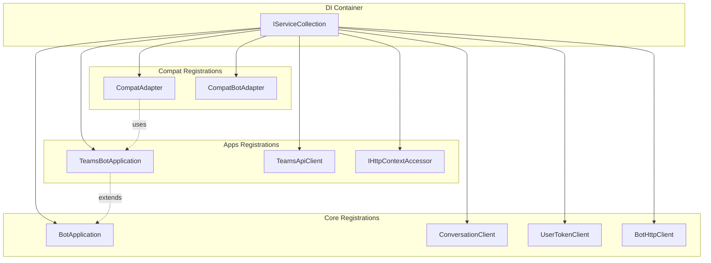

### 2. **Configuration Pattern**

Hierarchical configuration with conventions.

```csharp
{
  "AzureAd": {
    "ClientId": "...",
    "TenantId": "...",
    "ClientSecret": "..."
  },
  "MicrosoftAppId": "...",
  "MicrosoftAppPassword": "...",
  "MicrosoftAppType": "MultiTenant"
}
```

**Configuration Precedence**:
1. Environment variables
2. appsettings.json
3. Configuration section (AzureAd, etc.)
4. Fallback defaults

### 3. **Authentication Pattern**

JWT bearer token authentication for API calls.

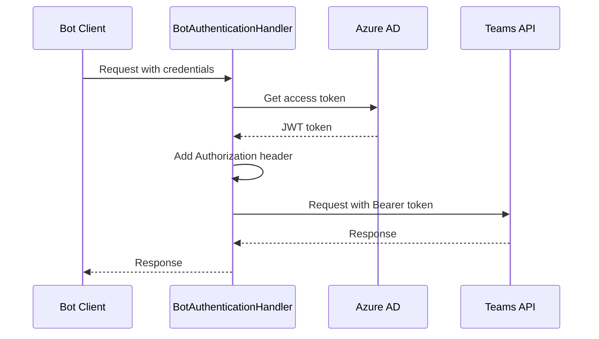

### 4. **Error Handling Pattern**

Structured exception handling with custom exceptions.

```csharp
public class BotHandlerException : Exception
{
    public CoreActivity Activity { get; }
    public BotHandlerException(CoreActivity activity, string message, Exception? innerException)
        : base(message, innerException)
    {
        Activity = activity;
    }
}
```

### 5. **Logging Pattern**

Structured logging with scopes and log levels.

```csharp
using (_logger.BeginScope("Processing activity {Type} {Id}", activity.Type, activity.Id))
{
    _logger.LogInformation("Processing activity {Type}", activity.Type);
    _logger.LogTrace("Activity details: {Activity}", activity.ToJson());
}
```

---

## Performance Considerations

### 1. **System.Text.Json Source Generation**

- **Core SDK**: Uses source-generated JSON serializers for zero-allocation deserialization
- **AOT Ready**: Supports ahead-of-time compilation
- **Performance**: 2-3x faster than reflection-based serialization

### 2. **Object Pooling**

- Reuses objects where possible to reduce GC pressure
- Particularly important for high-throughput scenarios

### 3. **Async/Await Best Practices**

- ConfigureAwait(false) used throughout to avoid context switching
- Cancellation token support for graceful shutdown
- ValueTask for hot paths where appropriate

### 4. **Minimal Allocations**

- Uses Span<T> and Memory<T> where applicable
- Avoids unnecessary string allocations
- Lazy initialization of expensive resources

---

## Testing Strategy

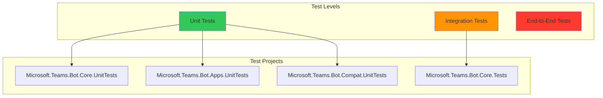

### Test Patterns

1. **Unit Tests**: Mock dependencies, test in isolation
2. **Integration Tests**: Test with live services (requires credentials)
3. **Compatibility Tests**: Verify Bot Framework v4 compatibility

---

## Summary

### Design Principles

1. **Separation of Concerns**: Clear layering with distinct responsibilities
2. **Dependency Inversion**: Depend on abstractions, not implementations
3. **Single Responsibility**: Each class has one reason to change
4. **Open/Closed**: Open for extension, closed for modification
5. **Performance First**: Optimized for high-throughput scenarios
6. **Backward Compatibility**: Smooth migration path from Bot Framework v4

### Key Takeaways

| Layer | Primary Pattern | Main Benefit |
|-------|----------------|--------------|
| **Core** | Middleware Pipeline | Extensible activity processing |
| **Apps** | Handler Pattern | Type-safe Teams-specific routing |
| **Compat** | Adapter Pattern | Seamless migration from Bot Framework v4 |

### Evolution Path

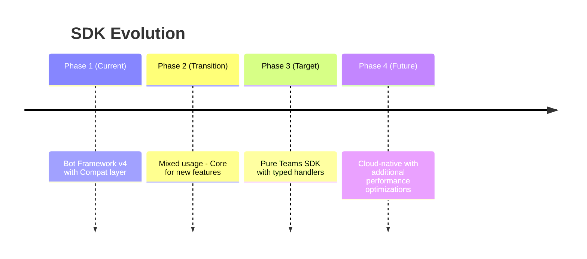
