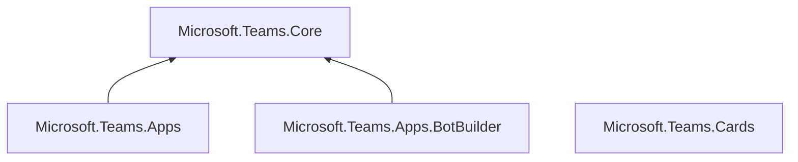
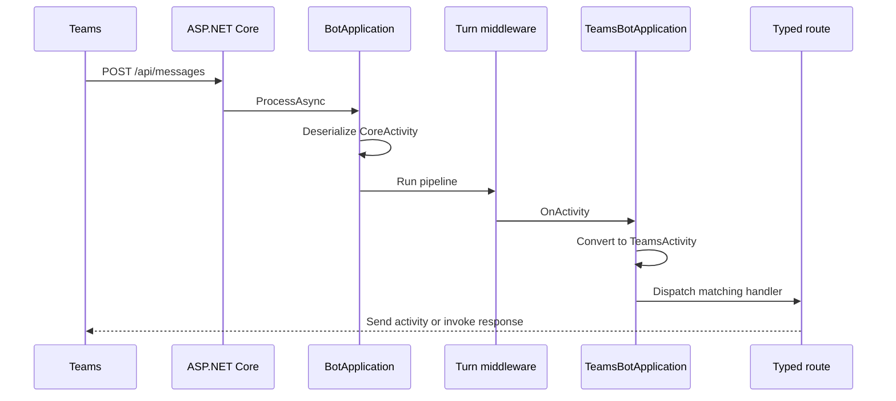
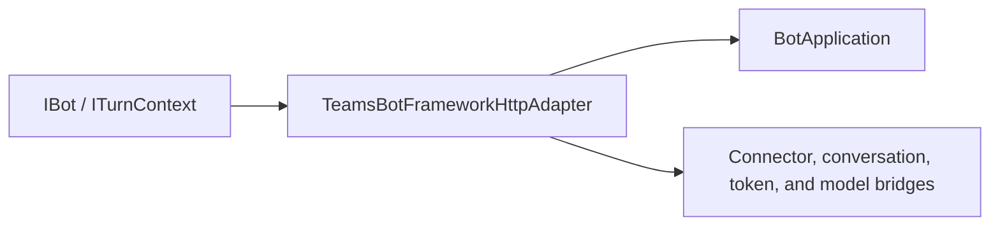

# Teams Bot SDK Architecture

## Overview

The SDK contains four packages targeting .NET 8 and .NET 10:


```mermaid
graph BT
    Apps["Microsoft.Teams.Apps"] --> Core["Microsoft.Teams.Core"]
    Compat["Microsoft.Teams.Apps.BotBuilder"] --> Core
    Cards["Microsoft.Teams.Cards"]
```

`Microsoft.Teams.Core` is the shared foundation. `Microsoft.Teams.Apps` and
`Microsoft.Teams.Apps.BotBuilder` are independent consumers of Core, so using
one does not pull in the other. `Microsoft.Teams.Cards` is standalone.

| Package | Responsibility | Use when |
|---|---|---|
| `Microsoft.Teams.Core` | Activity protocol, HTTP hosting, authentication, middleware, conversations, and user tokens | Building directly on the protocol or providing infrastructure |
| `Microsoft.Teams.Apps` | Teams schemas, typed routing, API clients, OAuth, state, streaming, and observability | Building a new Teams bot |
| `Microsoft.Teams.Apps.BotBuilder` | Bot Framework SDK v4 adapter and model/client bridges | Migrating an existing Bot Framework bot |
| `Microsoft.Teams.Cards` | Adaptive Cards and Teams-specific card elements | Creating cards independently of the bot runtime |

## Runtime flow


```mermaid
sequenceDiagram
    participant Teams
    participant Host as ASP.NET Core
    participant Core as BotApplication
    participant Middleware as Turn middleware
    participant Apps as TeamsBotApplication
    participant Route as Typed route

    Teams->>Host: POST /api/messages
    Host->>Core: ProcessAsync
    Core->>Core: Deserialize CoreActivity
    Core->>Middleware: Run pipeline
    Middleware->>Apps: OnActivity
    Apps->>Apps: Convert to TeamsActivity
    Apps->>Route: Dispatch matching handler
    Route-->>Teams: Send activity or invoke response
```

1. ASP.NET Core maps the bot endpoint and authenticates the request.
2. `BotApplication` deserializes a `CoreActivity`, validates request context,
   and runs registered `ITurnMiddleware`.
3. `TeamsBotApplication` converts the activity to `TeamsActivity`, loads
   optional turn state, and dispatches it through `Router`.
4. A typed handler receives `Context<TActivity>`, which exposes the activity,
   logging, state, and send/reply operations.
5. Outbound operations use `ApiClient`, `ConversationClient`, or
   `UserTokenClient` through authenticated `HttpClient` instances.

Invoke activities return an HTTP response through the current
`IHttpContextAccessor`. Other activity types are handled asynchronously through
the same routing pipeline.

## Package details

### Microsoft.Teams.Core

Core owns functionality shared by both application models:

- `BotApplication`: HTTP activity processing and the final activity callback.
- `CoreActivity`: extensible Activity Protocol model using
  `System.Text.Json`.
- `TurnMiddleware` and `ITurnMiddleware`: ordered turn pipeline.
- `ConversationClient`: send, update, delete, and conversation operations.
- `UserTokenClient`: OAuth token operations.
- `BotAuthenticationHandler` and hosting extensions: authentication, DI, and
  endpoint mapping.

Core deliberately avoids Teams-specific routing and Bot Framework SDK types.

### Microsoft.Teams.Apps

Apps extends `BotApplication` with the high-level Teams programming model:

- `TeamsBotApplication` and `Router` dispatch typed message, invoke,
  conversation, meeting, reaction, event, message extension, and task handlers.
- `Context<TActivity>` provides turn-scoped operations.
- `ApiClient` groups conversation, member, reaction, team, meeting, batch, and
  user-token clients.
- OAuth flows and optional distributed-cache-backed turn state are configured
  through `TeamsBotApplicationOptions`.
- Streaming and OpenTelemetry hooks are built into the application layer.

New bots should normally start here:

```csharp
var builder = WebApplication.CreateBuilder(args);
builder.Services.AddTeamsBotApplication(options => options.UseState());

var app = builder.Build();
var teams = app.UseTeamsBotApplication();

teams.OnMessage(async (context, ct) =>
{
    await context.SendAsync($"You said: {context.Activity.Text}", ct);
});

app.Run();
```

`AddTeamsBotApplication<TApp>()` and `UseTeamsBotApplication<TApp>()` support a
custom `TeamsBotApplication` subclass. The older `AddTeams`, `UseTeams`,
`AppBuilder`, and `App.Builder()` APIs are compatibility shims and are
deprecated.

### Microsoft.Teams.Apps.BotBuilder

The compatibility package depends on Core, not Apps. It adapts the Core runtime
to Bot Framework SDK v4 contracts:


```mermaid
graph LR
    BF["IBot / ITurnContext"] --> Adapter["TeamsBotFrameworkHttpAdapter"]
    Adapter --> Core["BotApplication"]
    Adapter --> Bridges["Connector, conversation, token, and model bridges"]
```

Register it with `AddTeamsBotFrameworkHttpAdapter()`. Existing `IBot`
implementations can then run on the Core hosting and authentication
infrastructure while migration proceeds incrementally.

### Microsoft.Teams.Cards

Cards provides a typed, `System.Text.Json`-based Adaptive Card model, builders,
actions, and Teams-specific payload helpers. It has no project dependency on
Core, Apps, or BotBuilder and can be used by any application.

## Configuration and hosting

All runtime packages use standard ASP.NET Core dependency injection,
configuration, `IHttpClientFactory`, and `ILogger`.

```json
{
  "AzureAd": {
    "Instance": "https://login.microsoftonline.com/",
    "TenantId": "<tenant-id>",
    "ClientId": "<client-id>",
    "Scope": "https://api.botframework.com/.default",
    "ClientCredentials": [
      {
        "SourceType": "ClientSecret",
        "ClientSecret": "<client-secret>"
      }
    ]
  }
}
```

The same values can be supplied by environment variables or another ASP.NET
Core configuration provider. Hosting extensions map `POST /api/messages` by
default; the route can be overridden.

## Design boundaries

1. Put protocol, transport, authentication, and shared hosting behavior in
   Core.
2. Put Teams-specific schemas, handlers, and APIs in Apps.
3. Keep Apps and BotBuilder independent to avoid unnecessary transitive
   dependencies.
4. Keep Cards usable without a bot application package.
5. Extend behavior through DI, middleware, typed routes, custom activity
   properties, or a `TeamsBotApplication` subclass.
