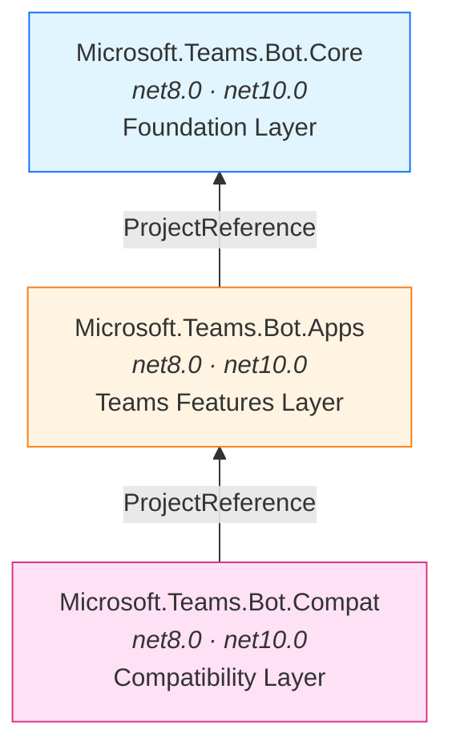
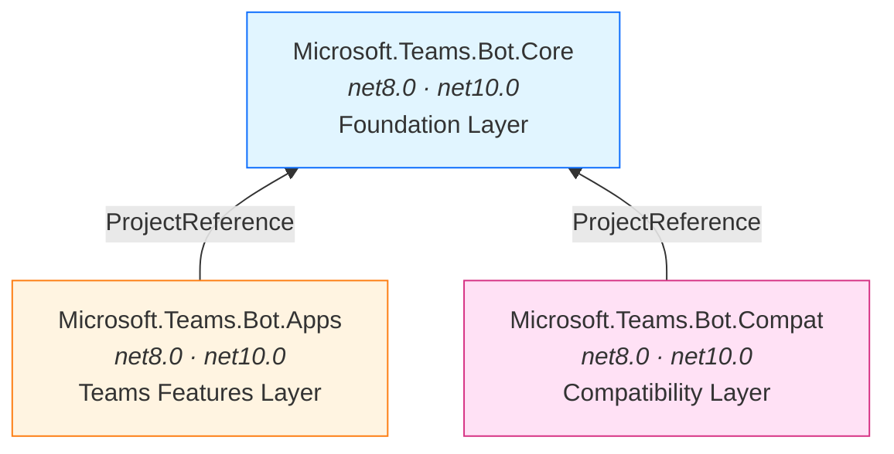
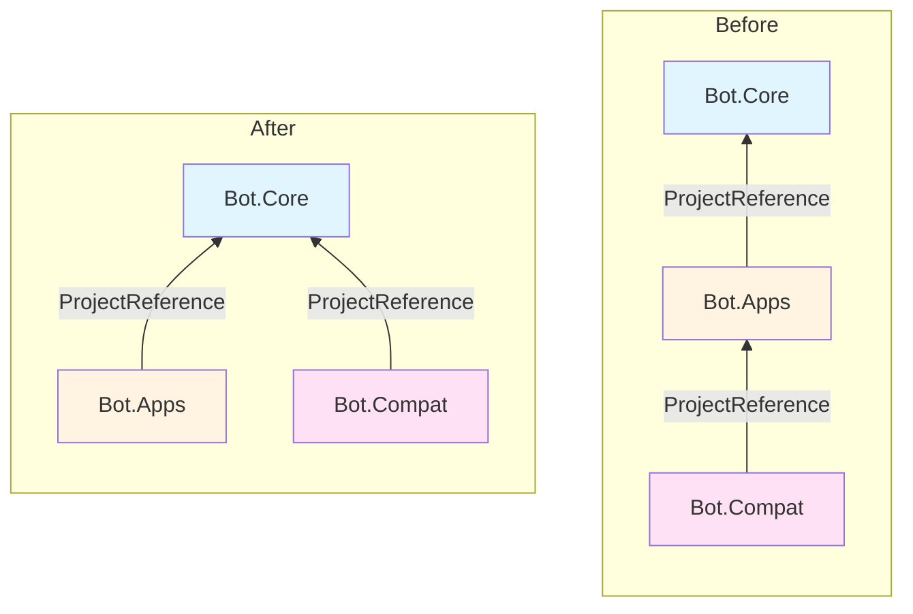
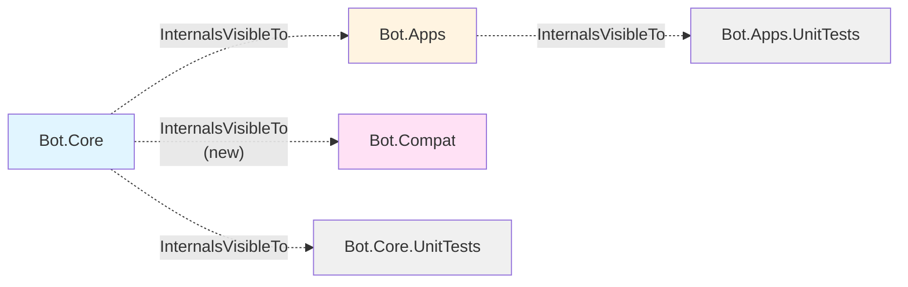
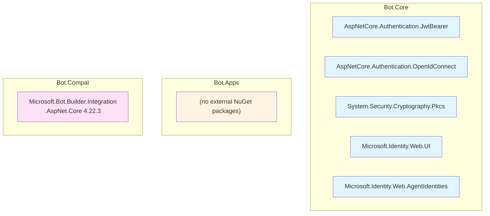
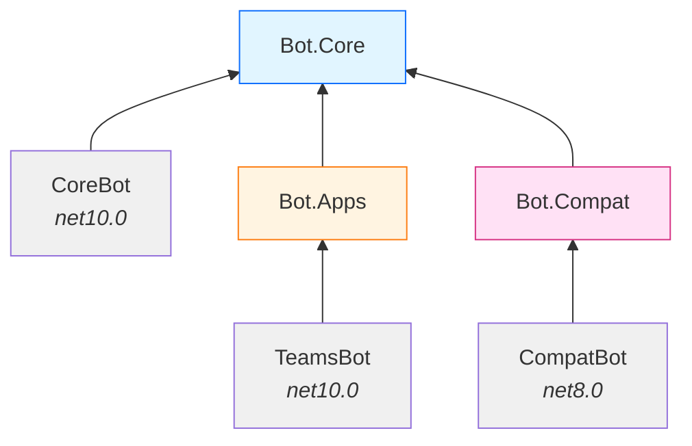

# Package Dependencies Design Document

This document describes the package dependency changes introduced in the `next/core-decouple-fe` PR within the `core/` SDK. The key change is decoupling `Bot.Compat` from `Bot.Apps` so that both depend directly on `Bot.Core` as independent siblings.

---

## Before: Linear Dependency Chain

Prior to this PR, `Bot.Compat` depended on `Bot.Apps`, which in turn depended on `Bot.Core`. This created a **linear chain** where Compat transitively pulled in everything from Apps.



### Problems with this structure

- **Unnecessary coupling**: `Bot.Compat` only needs `Bot.Core` (activity model, conversation client, hosting), but was forced to take a dependency on the entire `Bot.Apps` layer (Teams-specific handlers, routing, streaming, Teams API client).
- **Larger transitive closure**: Any consumer of `Bot.Compat` also pulled in `Bot.Apps` as a transitive dependency, even if they never used Teams-specific features.
- **Breaking change risk**: Changes to `Bot.Apps` could break `Bot.Compat` consumers even when the Compat layer only used Core types.
- **InternalsVisibleTo gap**: `Bot.Core` only exposed internals to `Bot.Apps`, so `Bot.Compat` had to go through Apps to access Core internals.

---

## After: Sibling Architecture

This PR changes `Bot.Compat` to reference `Bot.Core` directly instead of `Bot.Apps`. Both `Apps` and `Compat` are now **independent siblings** that share only the `Core` foundation.



---

## Side-by-Side Comparison



| Metric | Before | After |
|--------|--------|-------|
| Dependency depth from Compat | 3 (Compat → Apps → Core) | 2 (Compat → Core) |
| Compat's transitive project refs | 2 (Apps + Core) | 1 (Core) |
| Packages coupled to Bot.Apps | Apps + Compat | Apps only |
| Core InternalsVisibleTo | Apps, Core.UnitTests | Apps, **Compat**, Core.UnitTests |

---

## What Changed

### 1. `Bot.Compat.csproj` — dependency target changed

```diff
  <ItemGroup>
-   <ProjectReference Include="..\Microsoft.Teams.Bot.Apps\Microsoft.Teams.Bot.Apps.csproj" />
+   <ProjectReference Include="..\Microsoft.Teams.Bot.Core\Microsoft.Teams.Bot.Core.csproj" />
  </ItemGroup>
```

### 2. `Bot.Core.csproj` — InternalsVisibleTo added for Compat

```diff
  <ItemGroup>
      <InternalsVisibleTo Include="Microsoft.Teams.Bot.Core.UnitTests" />
      <InternalsVisibleTo Include="Microsoft.Teams.Bot.Apps" />
+     <InternalsVisibleTo Include="Microsoft.Teams.Bot.Compat" />
  </ItemGroup>
```

### 3. Compat source code — rewritten to use Core types directly

Types in `Bot.Compat` (e.g., `CompatActivity`, `CompatTeamsInfo`, `CompatHostingExtensions`) were updated to import from `Microsoft.Teams.Bot.Core` namespaces instead of going through `Microsoft.Teams.Bot.Apps`.

---

## InternalsVisibleTo Relationships

Before, only `Bot.Apps` could access Core internals. Now both sibling packages can.



---

## NuGet Dependencies Per Layer

The external NuGet dependency layout is unchanged — but the transitive impact is different:



**Before**: A `Bot.Compat` consumer transitively received all NuGet packages from Core **plus** the entire `Bot.Apps` assembly.

**After**: A `Bot.Compat` consumer only receives Core's NuGet packages. `Bot.Apps` is no longer in the transitive closure.

---

## Sample Application Dependency Patterns

Samples demonstrate three independent entry points:



| Entry Point | When to Use |
|-------------|-------------|
| **Bot.Core** directly | Minimal bots needing only core activity handling, middleware, and conversation client |
| **Bot.Apps** | Teams-specific bots with typed handlers, routing, streaming, Teams API client |
| **Bot.Compat** | Migrating existing Bot Framework v4 bots — no longer pulls in Bot.Apps transitively |

---

## Design Rationale

1. **Decoupled Compat from Apps**: `Bot.Compat` only needs Core primitives (activities, conversation client, hosting). Removing the Apps dependency eliminates unnecessary coupling.
2. **Smaller transitive closure**: Consumers of `Bot.Compat` no longer pull in the entire Teams-specific layer (`Bot.Apps`) as a transitive dependency.
3. **Independent evolution**: `Bot.Apps` and `Bot.Compat` can now be versioned and modified independently without risk of cross-impact.
4. **Direct internal access**: Adding `InternalsVisibleTo` for Compat on Core removes the need to route through Apps to access shared infrastructure like `BotHttpClient` and serialization contexts.
5. **Clearer architecture**: The sibling pattern makes the SDK's layering explicit — Core is the shared foundation, Apps adds Teams features, Compat bridges to Bot Framework v4.
