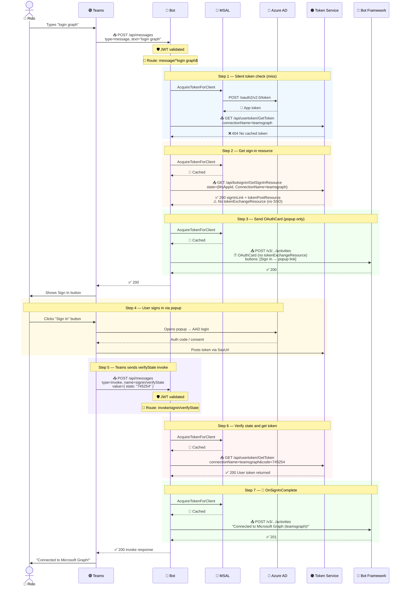
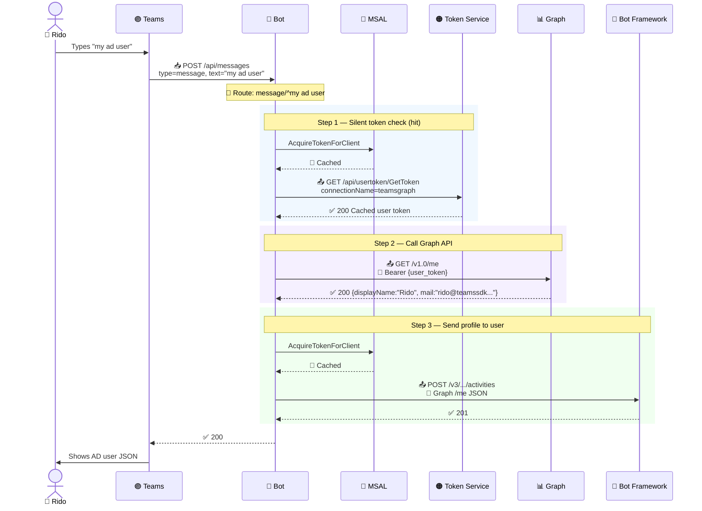
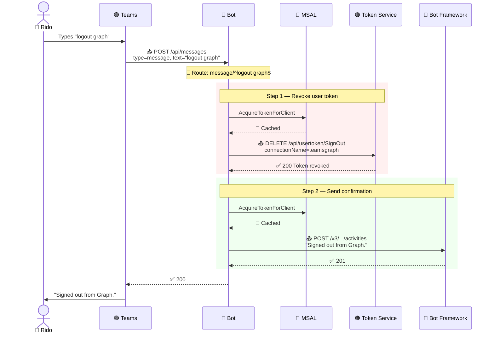

# 🔐 OAuthFlowBot — Sequence Diagrams (Popup Fallback)

Trace from 2026-04-22 03:12 UTC. Connection `teamsgraph` (Azure AD v2, no SSO configured).
Sign-in completes via **popup window** + `signin/verifyState` — no silent SSO.

---

## 🔑 Login Flow (Popup Sign-In)

---

## 👤 "my ad user" Flow (token cached)

---

## 🚪 Logout Flow

