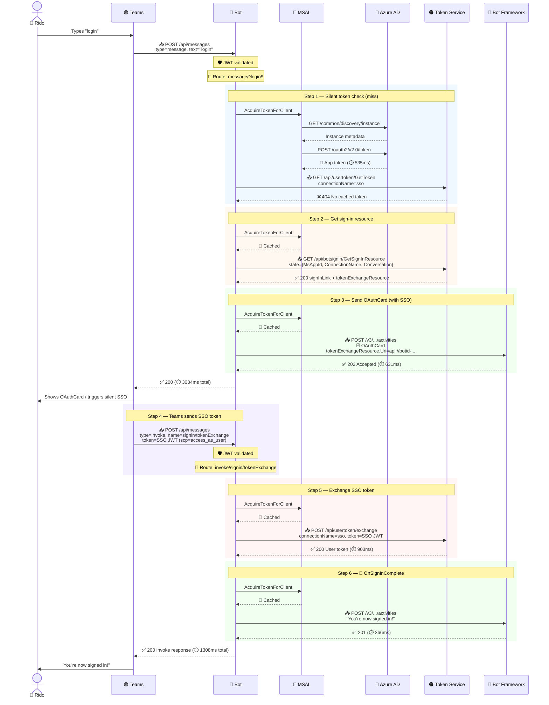
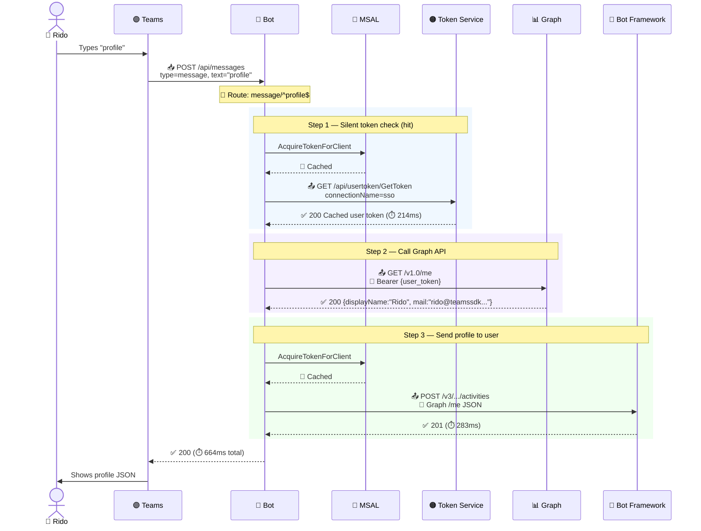
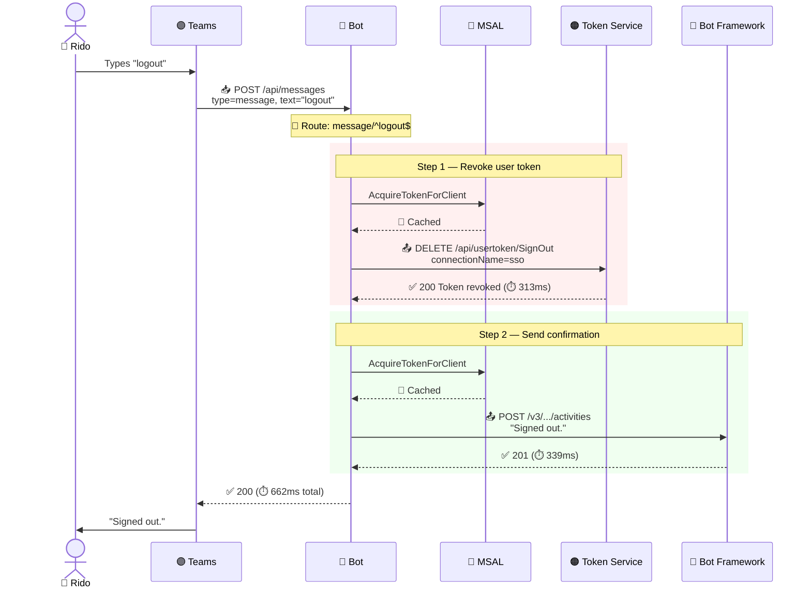

# 🔐 SsoBot — Sequence Diagrams (Silent SSO)

Trace from 2026-04-22 02:45 UTC. Connection `sso` (Azure AD v2 with SSO).
Sign-in completes via silent `signin/tokenExchange` — no popup needed.

---

## 🔑 Login Flow

---

## 👤 Profile Flow (token cached)

---

## 🚪 Logout Flow

