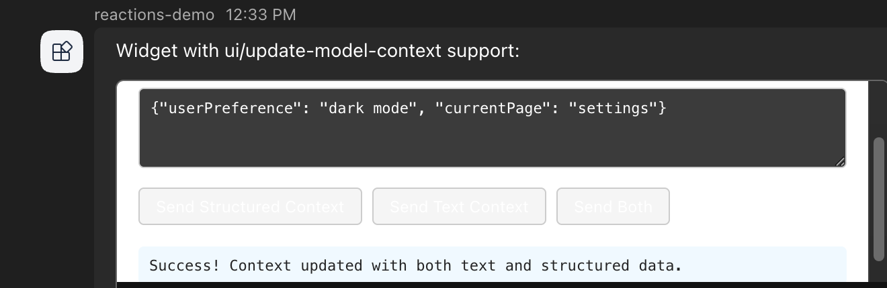
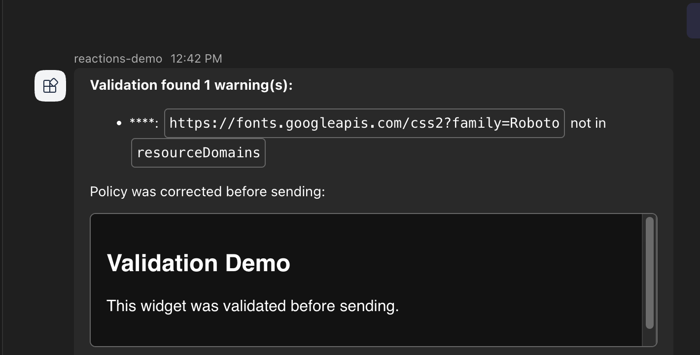
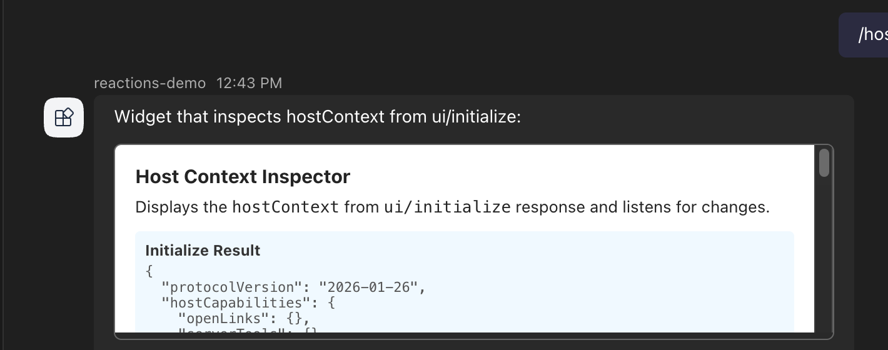

# HTML Widgets Example

This example bot demonstrates the HTML widget contract for Teams bots using the .NET Teams SDK.

## Demo

The bot renders several HTML widgets in Teams.
Each command below maps to a widget that exercises part of the widget contract.

### Static rendering (`/simple`)

A static widget renders directly from markdown with no callbacks.


### messageBack round-trip (`/messageback`)

Clicking the widget button sends a `messageBack` to the bot, which echoes the received value.


### Update model context (`/context`)

The widget sends structured and text context to the model using `ui/update-model-context`.



### Fullscreen display mode (`/fullscreen`)

The widget requests fullscreen mode from Teams and expands to fill the available space.


### Payload validation (`/validate`)

The SDK validates the widget payload before sending and reports policy warnings.



### Host context inspection (`/hostcontext`)

The widget reads the `hostContext` from the `ui/initialize` response.



## Commands

| Command | Purpose | Widget callbacks |
|---------|---------|-----------------|
| `/simple` | Static widget rendering (no callbacks) | None |
| `/calltool` | Widget calling bot tools | `htmlwidget/calltool` invoke |
| `/messageback` | Widget sending messageBack | `onMessage` |
| `/fullscreen` | Widget requesting display mode change | `onRequestDisplayMode` (client-side) |
| `/multi` | Multiple tool dispatch | `htmlwidget/calltool` with different tool names |
| `/openlink` | Widget opening links via host | `ui/open-link` |
| `/context` | Widget updating model context | `ui/update-model-context` |
| `/hostcontext` | Inspecting host context from initialize | `ui/initialize` response |
| `/validate` | Security policy validation demo | None |
| `/help` | List available commands | None |

## Architecture

```
Bot sends message:
  textFormat: 'extendedmarkdown'
  text: "...\n```html-widget\n{JSON payload}\n```"

Teams client:
  McpWidgetRenderer loads widget HTML in sandboxed iframe
  MCP Apps protocol provides tools/call via postMessage

Widget calls tool:
  postMessage -> McpWidgetRenderer -> htmlwidget/calltool invoke -> Bot

Bot returns (invoke response body):
  {
    responseType: 'htmlwidget/calltoolresult',
    callToolResult: { content: [...], structuredContent: {...}, isError: false }
  }
```

The `HtmlWidgetHelpers.BuildHtmlWidgetMessage` helper builds the `extendedmarkdown`
message with the widget JSON wrapped in the required `html-widget` fenced code block.

## Running

1. Copy credentials into the sample directory (see `bots/README.md` for setup).

2. Start a devtunnel and update the Azure Bot endpoint.

3. Run the bot:
   ```bash
   dotnet run
   ```

4. In Teams, message the bot with `/help` to see available commands.
