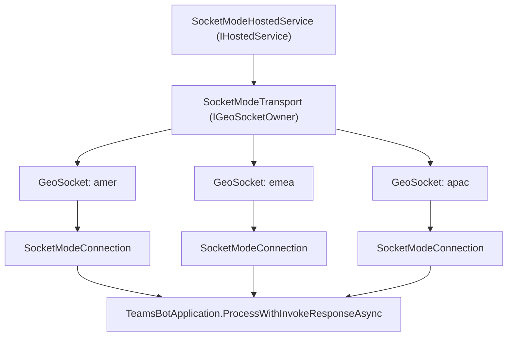

# Socket Mode Design

> **Status note:** This branch contains only the low-level Socket Mode transport
> primitives (`SignalRClientConnection`, `SignalRSocketConnection`,
> `SocketModeConnection`, `SocketModeEnvelope`, `SocketModeJson`,
> `SocketModeNegotiator`, `SocketModeProtocol`, `SocketModeProtocolModels` under
> `src/Microsoft.Teams.Apps/SocketMode/`). The higher-level pieces described
> below (`GeoSocket`, `SocketModeTransport`, `SocketModeOptions`,
> `SocketModeHostedService`, `SocketModeServiceRegistration`, and the
> `UseSocketMode` / `host.UseTeamsBotApplication()` integration) are landing via
> a follow-up PR stack based on
> [#686](https://github.com/microsoft/teams.net/pull/686). This document
> describes the complete, intended design regardless of what has merged so far.
>
> For implementation-level walkthroughs, see
> [SocketModeTransport-Walkthrough.md](./SocketModeTransport-Walkthrough.md),
> [GeoSocket-Walkthrough.md](./GeoSocket-Walkthrough.md), and
> [SignalRClientConnection-and-SocketModeConnection-Walkthrough.md](./SignalRClientConnection-and-SocketModeConnection-Walkthrough.md).

## Overview

Socket Mode lets a bot receive activities over outbound WebSocket connections
instead of exposing an inbound HTTP endpoint. The bot dials out to the Bot
Framework service (SignalR-based), so no public URL needs to be reachable from
Teams.

Socket Mode is supported **only in the public cloud**. It is an **experimental
feature**, marked with `[Experimental("ExperimentalTeamsSocketMode")]`, and is
recommended only for developing and testing agents locally or in constrained
network environments -- not for production workloads.

## Architecture

Socket Mode maintains **one connection per geo**. The default geos are `amer`,
`emea`, and `apac`.



Each geo is managed independently by a `GeoSocket` supervisor, which:

- Establishes an initial ready connection within a startup budget
  (`StartupTimeout`, default 30s).
- Supervises the connection in the background for the lifetime of the host.
- Reconnects after unexpected closures, without affecting other geos.

A `SocketModeTransport` owns all configured `GeoSocket` instances (one per
geo) and implements `IGeoSocketOwner`. It supplies the shared retry/backoff
policy to each `GeoSocket` and dispatches inbound activities into the app's
pipeline.

`SocketModeHostedService` is an `IHostedService` that starts the transport.
Host startup does not complete until every configured geo has an initial ready
connection; if a geo fails to become ready within its startup budget, the
failure surfaces out of `host.Run()` instead of failing silently in the
background.

## Negotiate flow

Before opening a WebSocket, each `GeoSocket` calls a negotiate HTTP endpoint
(`SocketModeNegotiator`) to obtain SignalR connection details:

1. The negotiate URL is `NegotiateBaseUrl` (default
   `https://botapi.skype.com`) plus a geo-specific path segment.
2. The request is authenticated with the bot's own app token, acquired via the
   standard client-credentials flow with scope
   `https://api.botframework.com/.default` -- the same credential the bot
   already uses for outbound Bot Framework API calls.
3. The response provides the actual SignalR connection info (endpoint URL and
   access token) used to open the WebSocket.

Socket Mode is restricted to the public cloud. This is enforced by checking
the bot's token issuer: it must be `https://api.botframework.com`. If the
configured cloud is not the public cloud, registration throws
`InvalidOperationException` rather than attempting to negotiate.

## Reconnect & token rotation

Connections are proactively rotated **make-before-break** ahead of token
expiry (`TokenRefreshMargin`):

1. A new-generation connection negotiates and connects while the current one
   keeps serving traffic.
2. Once the new connection reports ready, the old connection is retired.
3. `HandoffWindow` controls how long the retiring connection keeps dispatching
   in-flight activities before it is torn down, so no activity is dropped
   during rotation.

On an **unexpected disconnect** (not a planned rotation), the `GeoSocket`
reconnects using one of two strategies:

- An explicit `ReconnectDelays` schedule, if configured -- the last delay in
  the list repeats for subsequent attempts.
- Capped exponential backoff with jitter, if no explicit schedule is
  configured.

Negotiate failures that return HTTP `401`/`403` are treated as **non-retryable
auth failures** (`SocketModeNegotiateException.IsNonRetryable`). In that case
the geo stops permanently until the app restarts, rather than retrying
forever, and `OnGeoDisconnected` is raised so the host/app can observe and log
the failure.

Each geo's failure is isolated: a permanently failed or reconnecting geo does
not affect the other configured geos, which keep running independently.

## Dispatch & invoke responses

Inbound activities received over a socket are handed to the app's normal
processing pipeline via:

```csharp
await teamsBotApplication.ProcessWithInvokeResponseAsync(
    activity,
    user: null,
    correlationVector: null,
    cancellationToken);
```

There is no per-activity principal -- the socket connection itself is already
authenticated with the bot's own app token, unlike the HTTP path where each
request carries its own bearer token.

Because there is no `HttpContext` in Socket Mode, the invoke response (status
code + body) that handlers normally write to the HTTP response is instead
captured through an `AsyncLocal` capture object scoped to the turn. After the
pipeline completes, the captured status and body are serialized and sent back
over the socket as the reply frame for that activity.

## Options (`SocketModeOptions`)

| Option | Default | Purpose |
|---|---|---|
| `NegotiateBaseUrl` | `https://botapi.skype.com` | Base URL for the per-geo negotiate call |
| `Geos` | `amer`, `emea`, `apac` | Geos to connect to; one `GeoSocket` per entry |
| `StartupTimeout` | 30s | Budget for a geo's initial connection to become ready during host startup |
| `ReconnectDelays` | none (exponential backoff) | Optional explicit reconnect delay schedule; last value repeats |
| `ReadinessTimeout` | 30s | Time allowed for a new connection (initial or rotated) to report ready |
| `KeepAliveInterval` | 15s | Interval for client-side keep-alive pings on the socket |
| `ServerTimeout` | 30s | Time without any server message before the connection is considered lost |

Options are **validated when the host starts** (inside
`SocketModeHostedService`), not at registration time -- registration only
records the configuration, so misconfiguration is reported alongside other
startup failures rather than during DI setup.

## Usage

Socket Mode requires a host **without** a web server, since it has no inbound
HTTP endpoint to map. Build the host with `Host.CreateApplicationBuilder()`
instead of `WebApplication.CreateBuilder()`:

```csharp
var builder = Host.CreateApplicationBuilder(args);

builder.Services.AddTeamsBotApplication(options =>
{
    options.UseSocketMode();
    // or with configuration:
    // options.UseSocketMode(o =>
    // {
    //     o.Geos = ["amer", "emea"];
    //     o.StartupTimeout = TimeSpan.FromSeconds(45);
    // });
});

var host = builder.Build();
host.UseTeamsBotApplication();

host.Run();
```

`host.UseTeamsBotApplication()` is an `IHost` overload that wires up
`SocketModeHostedService` instead of mapping an HTTP route.

Mixing Socket Mode with a web server is rejected: calling the
`WebApplication` / `IEndpointRouteBuilder` overloads of
`UseTeamsBotApplication()`, or building with `WebApplication.CreateBuilder()`
while Socket Mode is enabled, throws `InvalidOperationException` with a
message pointing at the correct host type to use instead.

Calling `options.UseSocketMode(false)` clears Socket Mode configuration and
falls back to the normal HTTP endpoint behavior.

## Sample

`samples/SocketModeBot` will contain a working end-to-end example once the
app-integration PR stack lands, showing the `Host.CreateApplicationBuilder()`
setup, `UseSocketMode()` configuration, and `host.UseTeamsBotApplication()`
wiring described above.
