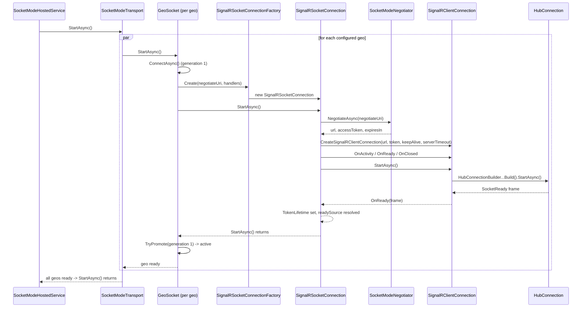
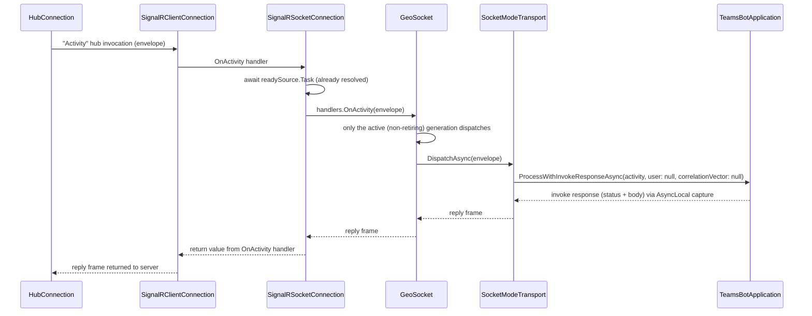
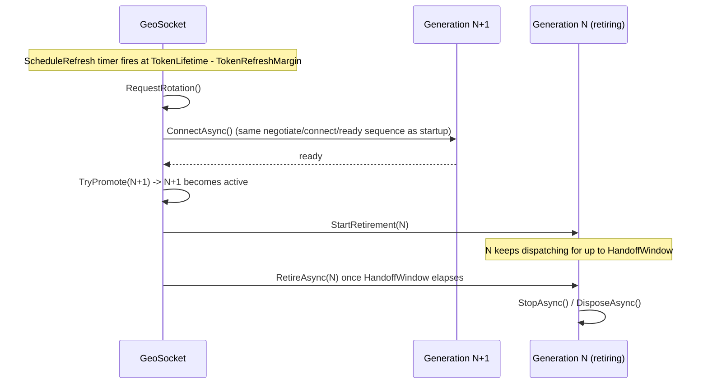
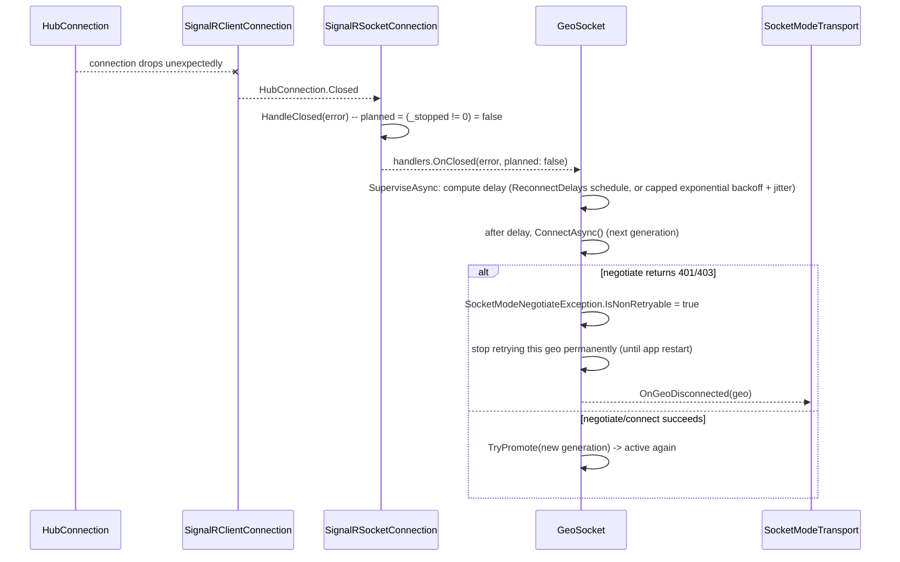

# Socket Mode Flow Walkthrough

> This is a single, flow-oriented walkthrough of the Socket Mode transport,
> replacing three earlier per-class walkthrough docs. Instead of going
> class-by-class, it follows four concrete sequences end-to-end: **startup**,
> **steady-state dispatch**, **make-before-break token rotation**, and
> **unexpected disconnect / reconnect**. See
> [SocketMode-Design.md](./SocketMode-Design.md) for the user-facing design
> and options.
>
> `SignalRClientConnection`, `SignalRSocketConnection`/
> `SignalRSocketConnectionFactory`, and `SocketModeConnection.cs`
> (`ISocketConnection`, `ISocketConnectionFactory`, `SocketConnectionHandlers`)
> are already on `main`. `GeoSocket` and `SocketModeTransport` are still
> landing via [PR #686](https://github.com/microsoft/teams.net/pull/686).

## Component map

```
SocketModeHostedService        (IHostedService; blocks host startup until every geo is ready)
        │
        ▼
SocketModeTransport            (implements IGeoSocketOwner; one GeoSocket per configured geo)
        │
        ▼
GeoSocket                      (per-geo supervisor: generations, rotation, retry/backoff)
        │ ISocketConnectionFactory.Create(...)
        ▼
SignalRSocketConnectionFactory / SignalRSocketConnection
        │ negotiates via SocketModeNegotiator, then builds
        ▼
SignalRClientConnection        (thin adapter over HubConnectionBuilder)
        │
        ▼
Microsoft.AspNetCore.SignalR.Client.HubConnection
```

`ISocketConnection` / `ISocketConnectionFactory` / `SocketConnectionHandlers`
(all in `SocketModeConnection.cs`) are the interfaces that let `GeoSocket`
depend on "some connection generation" without knowing SignalR exists.

## 1. Startup

`SocketModeHostedService` doesn't finish starting until **every** geo has a
ready connection (within `StartupTimeout`, default 30s). A failure here
surfaces from `host.Run()`.



If a geo's `ConnectAsync` fails to reach ready within `StartupTimeout` (e.g.
negotiate 401/403, or `ReadinessTimeout` elapses waiting for `SocketReady`),
that failure propagates up through `Transport.StartAsync()` and
`Host.StartAsync()`, so the whole host fails to start rather than running
with a silently-missing geo.

## 2. Steady-state dispatch

Once a generation is active, inbound activity envelopes flow straight
through to the existing `TeamsBotApplication` pipeline -- there is no
parallel activity-processing framework.



No per-activity principal is attached -- the socket connection itself is
already authenticated with the bot's app token. The invoke response is
captured via an `AsyncLocal` object instead of `HttpContext`, since there is
no HTTP context in Socket Mode.

## 3. Make-before-break token rotation

Connections are rotated **before** their token expires (`TokenRefreshMargin`
before `TokenLifetime` runs out), so there's no gap where the active
connection is unauthenticated.



During the handoff window there are briefly **two** live generations for the
same geo: the new one is already active for new dispatch, while the old one
finishes out its window so in-flight requests aren't dropped mid-rotation.

## 4. Unexpected disconnect & reconnect

Unplanned closures (network blips, server-initiated drops) are distinguished
from planned ones (rotation, shutdown) via the `planned` flag on
`OnClosed(error, planned)`.



Each geo is isolated: one geo permanently failing (non-retryable auth
failure) does not affect the others, which keep running and reconnecting
independently.

## Class responsibilities (quick reference)

| Class | Responsibility | Status |
|---|---|---|
| `SocketModeHostedService` | `IHostedService`; blocks host startup until every geo is ready | PR #686 |
| `SocketModeTransport` | Implements `IGeoSocketOwner`; owns all `GeoSocket`s; dispatches to `TeamsBotApplication` | PR #686 |
| `GeoSocket` | Per-geo supervisor: generations, make-before-break rotation, retry/backoff, non-retryable failure isolation | PR #686 |
| `SignalRSocketConnectionFactory` / `SignalRSocketConnection` | One connection generation's lifecycle: negotiate, readiness gate, `TokenLifetime` | `main` |
| `SignalRClientConnection` | Thin adapter over `HubConnectionBuilder`; the only class that touches it directly | `main` |
| `SocketModeConnection.cs` (`ISocketConnection`, `ISocketConnectionFactory`, `SocketConnectionHandlers`) | Interface seam between `GeoSocket` and the SignalR-backed implementation; no SignalR code | `main` |
| `SocketModeNegotiator` | Negotiates SignalR connection info against the negotiate HTTP endpoint | `main` |
