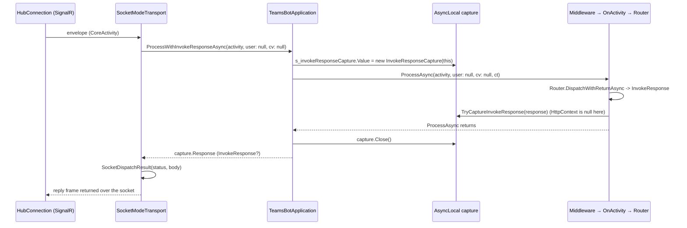

# Socket Mode Hosting & Dispatch Integration

> This doc covers how Socket Mode plugs into the rest of the SDK: DI
> registration, host startup, and how an inbound activity reaches the same
> `TeamsBotApplication` pipeline as the HTTP transport. See
> [SocketMode-Design.md](./SocketMode-Design.md) for the user-facing design
> and [SocketMode-Flow-Walkthrough.md](./SocketMode-Flow-Walkthrough.md) for
> the transport's own connection/rotation sequences.

## One pipeline, two transports

Socket Mode does not duplicate activity processing. Both transports funnel
into the same `BotApplication.ProcessAsync(CoreActivity, ...)` method; only
how the activity is obtained, and how the response is returned, differs.

```
HTTP transport            Socket Mode transport
      │                          │
ProcessAsync(HttpContext)   SocketModeTransport.HandleEnvelopeAsync
      │                          │
      └──────────┬───────────────┘
                 ▼
   ProcessAsync(CoreActivity, user, correlationVector, cancellationToken)
                 │
        middleware pipeline → OnActivity → Router → handlers
```

The HTTP overload is now a thin wrapper: it deserializes the request body
into a `CoreActivity`, then delegates to the transport-agnostic overload:

```csharp
public virtual async Task ProcessAsync(HttpContext httpContext, CancellationToken cancellationToken = default)
{
    CoreActivity activity = await CoreActivity.FromJsonStreamAsync(httpContext.Request.Body, cancellationToken)
        ?? throw new InvalidOperationException("Invalid Activity");

    await ProcessAsync(activity, httpContext.User, httpContext.Request.GetCorrelationVector(), cancellationToken);
}
```

Socket Mode calls the transport-agnostic overload directly (via
`TeamsBotApplication.ProcessWithInvokeResponseAsync`, below) since it never
has an `HttpContext` to begin with -- there is no per-activity principal
either, because the socket connection itself is already authenticated with
the bot's own app token (`user: null`).

## DI registration: `AddTeamsBotApplication`

`AddTeamsBotApplication<TApp>` registers `TApp`, its options, and the API
client exactly as it does today. If `TeamsBotApplicationOptions.SocketMode`
is non-null (set via `options.UseSocketMode(...)`), it additionally calls
`SocketModeServiceRegistration.AddSocketMode<TApp>`, which registers:

| Service | Lifetime | Purpose |
|---|---|---|
| `ISocketModeNegotiator` | Singleton | Calls the negotiate HTTP endpoint using a dedicated, credential-free `HttpClient` plus the bot's own app token |
| `ISocketConnectionFactory` (`SignalRSocketConnectionFactory`) | Singleton | Creates one `SignalRSocketConnection` per connection generation |
| `SocketModeTransport` | Singleton | Owns one `GeoSocket` per configured geo; built with a dispatch delegate (below) |
| `SocketModeHostedService` | Hosted service | Starts/stops the transport with the host |

Cloud support is checked here, at registration time: if the bot's token
issuer isn't `https://api.botframework.com`, `AddSocketMode` throws
`InvalidOperationException` immediately rather than waiting for host
startup. Everything else (timeouts, geo list, etc.) is validated later, when
the host actually starts and the transport is constructed -- "invalid
options fail when the host starts, as in the other SDKs."

The dispatch delegate wired into `SocketModeTransport` is where Socket Mode
re-enters the shared pipeline:

```csharp
internal static async Task<SocketDispatchResult> DispatchAsync(TeamsBotApplication app, CoreActivity activity)
{
    // No per-activity principal: the connection itself was authenticated with the bot's own token.
    InvokeResponse? response = await app.ProcessWithInvokeResponseAsync(activity, user: null, correlationVector: null);
    return response is null
        ? new SocketDispatchResult(200)
        : new SocketDispatchResult(response.Status, response.Body);
}
```

## Host startup: `UseSocketMode()` vs. a web server

`UseTeamsBotApplication` has four overloads, but they all funnel into one
rule: **Socket Mode needs a host without a web server; HTTP needs one.**

- `UseTeamsBotApplication(this IEndpointRouteBuilder, routePath)` and
  `UseTeamsBotApplication(this WebApplication, routePath)` -- the HTTP
  overloads. Both throw `InvalidOperationException` if Socket Mode is
  enabled (`TeamsBotApplicationOptions.SocketMode is not null`).
- `UseTeamsBotApplication(this IHost)` -- the Socket Mode overload. If Socket
  Mode is *not* enabled, it falls back to requiring `host` to also be an
  `IEndpointRouteBuilder` (e.g. a `WebApplication`) and maps the HTTP route
  instead. If Socket Mode *is* enabled and `host` also happens to implement
  `IEndpointRouteBuilder` (i.e. someone built a `WebApplication` anyway), it
  throws the same mismatch error.

```
                    UseSocketMode() called in AddTeamsBotApplication?
                              │
                 ┌────────────┴────────────┐
                no                        yes
                 │                         │
     host must be IEndpointRouteBuilder     host must NOT be IEndpointRouteBuilder
     (WebApplication.CreateBuilder())      (Host.CreateApplicationBuilder())
                 │                         │
          map HTTP route              resolve TApp; SocketModeHostedService
       (api/messages, default)         drives it via IHostedService
```

Passing `UseSocketMode(false)` clears `TeamsBotApplicationOptions.SocketMode`
back to `null`, so the host falls back to the HTTP path -- the same check
(`SocketMode is not null`) governs both registration and host wiring.

## `SocketModeHostedService.StartAsync`

Once the host starts, `SocketModeHostedService` (an `IHostedService`) does
two things before the transport connects anything:

1. **Guards against a web server.** It resolves
   `IServiceProviderIsService` and asks whether `IServer` is a registered
   service. A `WebApplication` always registers `IServer`; a plain
   `Host.CreateApplicationBuilder()` host never does. If `IServer` is
   present, it throws the same `SocketWithWebServerMessage` used by the
   `UseTeamsBotApplication` overloads above -- this is the second, defense-
   in-depth place that mismatch is caught (the first being
   `UseTeamsBotApplicationCore` when `host.UseTeamsBotApplication()` is
   called).
2. **Resolves `SocketModeTransport` from DI and starts it**, rather than
   having it injected into the constructor. This is deliberate: constructing
   `SocketModeTransport` validates `SocketModeOptions` (geo list, timeouts,
   etc.), so any invalid option surfaces from `host.StartAsync()` /
   `host.Run()`, not from a background task that might swallow the
   exception.

`StopAsync` mirrors this: if the transport never started, it's a no-op;
otherwise it calls `SocketModeTransport.StopAsync()`.

## Returning the invoke response without `HttpContext`

`TeamsBotApplication`'s shared `OnActivity` handler (used by both
transports) currently writes invoke responses straight to `HttpContext`:

```csharp
InvokeResponse invokeResponse = await Router.DispatchWithReturnAsync(defaultContext, cancellationToken);
HttpContext? httpContext = httpContextAccessor.HttpContext;
if (invokeResponse is not null && TryCaptureInvokeResponse(invokeResponse))
{
    // Socket Mode (or any non-HTTP transport): captured, not written to HttpContext.
}
else if (httpContext is not null && invokeResponse is not null)
{
    httpContext.Response.StatusCode = invokeResponse.Status;
    await httpContext.Response.WriteAsJsonAsync(invokeResponse.Body, cancellationToken);
}
```

`TryCaptureInvokeResponse` checks an `AsyncLocal<InvokeResponseCapture?>`
that's set up around the call, not an instance field -- a single
`TeamsBotApplication` instance processes many activities concurrently, and
each turn's handler must only see *its own* capture:

```csharp
internal async Task<InvokeResponse?> ProcessWithInvokeResponseAsync(
    CoreActivity activity, ClaimsPrincipal? user, string? correlationVector, CancellationToken cancellationToken = default)
{
    InvokeResponseCapture capture = new(this);
    s_invokeResponseCapture.Value = capture;
    try
    {
        await ProcessAsync(activity, user, correlationVector, cancellationToken);
    }
    finally
    {
        capture.Close();
    }

    return capture.Response;
}
```

`InvokeResponseCapture` is a small mutable holder (`Owner`, `Response`,
`TrySet`, `Close`) rather than the response itself, because the value has to
be *set* deep inside the pipeline (inside `OnActivity`) but *read* back out
here, after `s_invokeResponseCapture`'s async-local value has flowed back up
through the `await`. `Close()` makes the capture reject any further
`TrySet` calls once this call is winding down, so a handler that (incorrectly)
keeps running after the turn completes can't race a stale write into a
capture whose `Response` has already been returned.

`TryCaptureInvokeResponse` further checks
`ReferenceEquals(capture.Owner, this)` -- it only captures for the exact
`TeamsBotApplication` instance that started this turn, so nothing bleeds
across instances in a multi-app host.

### Why not just detect "no `HttpContext`"?

Because a Socket Mode activity is processed on threads where
`IHttpContextAccessor.HttpContext` is simply `null` (there was never an
HTTP request), checking `httpContext is null` alone would work for
*detecting* Socket Mode. But the capture-first check exists so the exact
same `OnActivity` code path serves **any** current or future non-HTTP
transport without new branching -- the transport opts in by setting the
`AsyncLocal` before calling `ProcessAsync`, rather than `OnActivity` having
to know which transport it's running under.

## End-to-end: from socket envelope to reply frame



## Summary

| Concern | HTTP transport | Socket Mode transport |
|---|---|---|
| Entry point | `ProcessAsync(HttpContext, ct)` | `ProcessWithInvokeResponseAsync(activity, user, cv, ct)` |
| Shared pipeline call | `ProcessAsync(CoreActivity, user, cv, ct)` | same |
| Per-activity principal | `httpContext.User` | `null` (connection-level auth) |
| Invoke response delivery | Written to `HttpContext.Response` | Returned via `AsyncLocal` capture, then converted to a reply frame |
| Host wiring | `WebApplication` / `IEndpointRouteBuilder` overloads | `IHost` overload + `SocketModeHostedService` |
| Registration-time validation | N/A | Cloud check (token issuer) |
| Startup-time validation | N/A | `SocketModeOptions` validated when `SocketModeTransport` is constructed by the hosted service |
